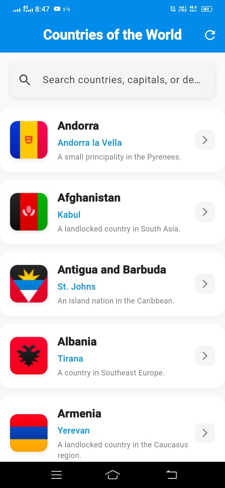
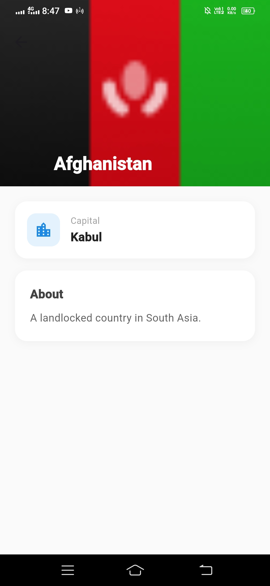
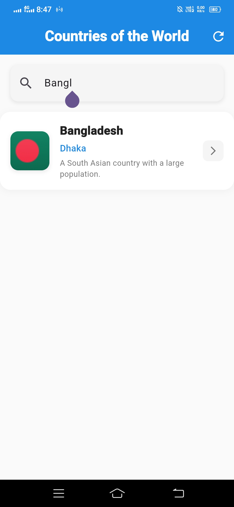

# 🌍 Countries of the World





A clean, modern Flutter application that lists countries from around the world with live search, pull-to-refresh, and a detailed country view — built with the **BLoC** state management pattern and a clean, layered architecture.

<p align="center">
  
  
  
  
</p>

---

## ✨ Features

- 🗺️ **Country List** — All countries displayed as clean, card-based list items
- 🔍 **Live Search** — Instantly filter by country name, capital, or description
- 📄 **Country Details** — Tap any country to view a dedicated detail screen with a large flag header, capital info, and full description
- 🔄 **Pull to Refresh** — Swipe down to re-fetch the latest data from the API
- 🧠 **BLoC State Management** — Predictable, testable state handling with `flutter_bloc` + `equatable`
- 🌐 **REST API Integration** — Fetches live country data over HTTP
- 🏗️ **Clean Architecture** — Model → Repository → Bloc → UI, each layer independently testable
- ⏳ **Graceful States** — Distinct loading, success, empty, and error states with retry support
- 🎨 **Material 3 Design** — Rounded cards, soft shadows, and a cohesive color scheme

---

## 📡 API

Country data is served from:

```
GET https://countrylist.teamrabbil.com/api/country-list
```

**Response shape** (per country):

```json
{
  "id": 297,
  "name": "Bangladesh",
  "capital": "Dhaka",
  "short_description": "A South Asian country with a large population.",
  "flag": "https://countrylist.teamrabbil.com/flag/BD@3x.png"
}
```

> ⚠️ Note the API uses **snake_case** keys (`short_description`), which must match exactly in `Country.fromJson` / `toJson` — a mismatch here is a common source of silently-null fields.

---

## 📁 Project Structure

```
lib/
├── models/
│   └── country.dart                  # Country data model (Equatable, JSON (de)serialization)
├── repositories/
│   └── country_repository.dart       # API layer — fetches & parses country data
├── blocs/
│   ├── country_event.dart            # FetchCountries, RefreshCountries
│   ├── country_state.dart            # Initial, Loading, Success, Error
│   └── country_bloc.dart             # Maps events → states via the repository
├── screens/
│   ├── country_list_screen.dart      # Root screen — provides CountryBloc, hosts AppBar + list
│   └── country_detail_screen.dart    # Detail view for a single country
├── widgets/
│   ├── searchable_country_list.dart  # Search bar + BlocBuilder-driven list/loading/error UI
│   └── country_list_item.dart        # Single country card (tap → detail screen)
└── main.dart                         # App entry point, RepositoryProvider setup
```

**Data flow at a glance:**

```
main.dart
  └─ RepositoryProvider<CountryRepository>
        └─ CountryListScreen
              └─ BlocProvider<CountryBloc>  --(FetchCountries)-->  CountryRepository --> API
                    └─ SearchableCountryList (BlocBuilder/BlocListener)
                          └─ CountryListItem  --tap-->  CountryDetailScreen
```

---

## 📦 Dependencies

| Package | Purpose |
|---|---|
| [`flutter_bloc`](https://pub.dev/packages/flutter_bloc) | State management (Bloc/Cubit + BlocBuilder/BlocListener) |
| [`equatable`](https://pub.dev/packages/equatable) | Value equality for events/states/models — avoids redundant rebuilds |
| [`http`](https://pub.dev/packages/http) | REST API calls |

Check `pubspec.yaml` for exact pinned versions.

---

## 🚀 Getting Started

### Prerequisites
- Flutter SDK installed ([install guide](https://docs.flutter.dev/get-started/install))
- A configured emulator/simulator or physical device
- Gradle/AGP versions compatible with your installed Flutter SDK (see [Troubleshooting](#-troubleshooting) if you hit a build error)

### Setup

```bash
# 1. Clone the repository
git clone https://github.com/Faisal60177/Flutter-App-Development/tree/class-28-Flutter-Country-list-app
cd flutter_project

# 2. Install dependencies
flutter pub get

# 3. Run the app
flutter run
```

To target a specific device:
```bash
flutter devices          # list available devices
flutter run -d <device-id>
```

---

## 🧠 State Management (BLoC)

| Layer | Responsibility |
|---|---|
| **Events** (`CountryEvent`) | `FetchCountries` (initial load), `RefreshCountries` (pull-to-refresh, no loading spinner) |
| **States** (`CountryState`) | `CountryInitial`, `CountryLoading`, `CountrySuccess(countries)`, `CountryError(message)` |
| **Bloc** (`CountryBloc`) | Listens for events, calls the repository, emits the resulting state |
| **Repository** (`CountryRepository`) | Owns the `http.Client`, calls the API, parses JSON into `Country` objects |

`CountryRepository` is provided once at the app root via `RepositoryProvider` and injected into `CountryBloc` — this keeps the bloc decoupled from *how* data is fetched, and makes both layers easy to mock in tests.

---

## 🖼️ UI Overview

- **App Bar** — Title + refresh action, wired to `RefreshCountries`
- **Search Bar** — Debounce-free live filtering across name, capital, and description
- **Country Card** — Flag thumbnail, name, capital, truncated description, and a tap target that opens the detail screen
- **Detail Screen** — Collapsing flag header (`SliverAppBar` + `FlexibleSpaceBar`), capital info card, full description card
- **Empty / Error States** — Friendly icons and copy, with a **Retry** button that re-dispatches `FetchCountries`

---

## 🛠️ Troubleshooting

**Gradle version too low**
```
Your project's Gradle version (X) is lower than Flutter's minimum supported version of (Y)
```
→ Update `distributionUrl` in `android/gradle/wrapper/gradle-wrapper.properties` to a Gradle version that meets your Flutter SDK's minimum, then run `flutter clean && flutter run`.

**`ProviderNotFoundException` for `CountryBloc`**
→ Make sure you're reading `context.read<CountryBloc>()` from a `BuildContext` that sits **below** the `BlocProvider` in the widget tree — not the same `build()` method that creates it. Wrap the consuming widget in a `Builder`, or extract it into its own widget.

**Field showing as empty/null despite the API returning a value**
→ Double-check the exact JSON key spelling and casing in `Country.fromJson`/`toJson` against the real API response (e.g. `short_description`, not `shortDescription` or `short_Description`) — Dart map key lookups are case-sensitive.

---

## 🗺️ Roadmap

- [ ] Favorites / bookmarking
- [ ] Offline caching (e.g. via `sqflite` or `hive`)
- [ ] Dark theme support
- [ ] Localization (multi-language UI)
- [ ] Advanced filters (region, population range, etc.)
- [ ] Unit & widget test coverage for bloc/repository/UI layers

---

## 📄 License

This project is open source. Add your preferred license (MIT recommended) in a `LICENSE` file at the project root.